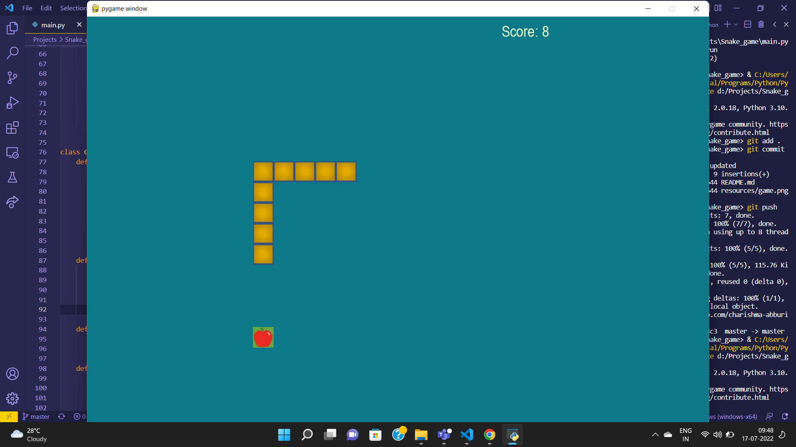

# Snake Game

<h4> Developed a game in Python using Pygame library where player controls a snake, which roams around on a
bordered plane, picking up an apple, trying to avoid hitting its own tail or the edges of the playing area.</h4>

## Preview
<h4>Demo video</h4>

https://user-images.githubusercontent.com/77400945/179384102-f19de8bf-6b9c-48ce-b369-bb9400a6b839.mp4

<h4>  Screenshot </h4>

